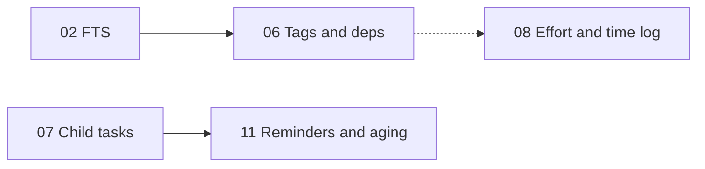

# Roadmap staging

Single source of truth for the forward-looking feature roadmap. Each row in the
pipeline below points at a self-contained plan document. Open the top
"Not started" row, flip it to "In progress", work the plan's own checklist, and
close it out here with any follow-ups or bugs surfaced during rollout.

This doc is the **forward-looking** counterpart to `../tech_decisions.md`
(which is the retrospective "why we decided what we decided" record). When a
plan lands, a short decision note goes into `tech_decisions.md` and the row
below is marked Done.

## How to use this doc

1. **Pick work.** Scan the pipeline table for the topmost row whose `Status` is
   `Not started`. Dependencies are listed further down; skip a row only if a
   listed dependency is still outstanding.
2. **Start the plan.** Update its row to `In progress`, fill in `Started`, and
   open the linked plan doc.
3. **Work the plan.** Follow the plan doc's own work breakdown checklist.
   Update the doc in place if scope shifts meaningfully; log the deviation in
   the [Decisions log](#decisions-log) section below.
4. **Land the plan.** Run the plan's validation checklist. On success:
   - Tick the docs checkboxes in the plan doc itself.
   - Mark the row below as `Done` with `Finished` date.
   - Append a short decision note in `../tech_decisions.md`.
   - Move discovered follow-ups to the [Follow-ups discovered](#follow-ups-discovered) table.
5. **If you hit bugs during rollout**, log them in
   [Bugs caught during rollout](#bugs-caught-during-rollout) rather than
   silently fixing and forgetting — the log is cheap insurance if a regression
   comes back later.

## Ordered pipeline

| #  | Plan                                                               | Tier | Status      | Started    | Finished   | Notes |
|----|--------------------------------------------------------------------|------|-------------|------------|------------|-------|
| 01 | [Dashboard and saved views](01_dashboard_and_saved_views.md)       | 1    | Done        | 2026-04-17 | 2026-04-17 | Dashboard tab + saved-views sidebar shipped. Last-tab restore + forward-compatible view schema included. |
| 02 | [Notes full-text search](02_notes_fulltext_search.md)              | 1    | Done        | 2026-04-23 | 2026-04-23 | FTS5 `task_search_fts`; service-layer sync; snippets in task list tooltips. |
| 03 | [Task templates](03_task_templates.md)                             | 1    | Done        | 2026-04-23 | 2026-04-23 | Templates + JSON I/O; New from template… draft then Save; `delete_task` for FTS. |
| 04 | [Attachments](04_attachments.md)                                   | 1    | Not started |            |            |       |
| 05 | [Quick capture](05_quick_capture.md)                               | 1    | Not started |            |            |       |
| 06 | [Tags and task dependencies](06_tags_and_dependencies.md)          | 2    | Not started |            |            |       |
| 07 | [Child tasks and rollup](07_child_tasks_rollup.md)                 | 2    | Not started |            |            |       |
| 08 | [Effort, time log, daily review](08_effort_and_time_log.md)        | 2    | Not started |            |            |       |
| 09 | [External links](09_external_links.md)                             | 2    | Not started |            |            |       |
| 10 | [Inbox actions (snooze + bulk edit)](10_inbox_actions.md)          | 2    | Not started |            |            |       |
| 11 | [Reminders and aging](11_reminders_and_aging.md)                   | 3    | Not started |            |            |       |
| 12 | [Board view](12_board_view.md)                                     | 3    | Not started |            |            |       |
| 13 | [Intake and migration](13_intake_and_migration.md)                 | 3    | Not started |            |            |       |
| 14 | [Safety net (auto-save + crash recovery)](14_safety_net.md)        | 3    | Not started |            |            |       |

Status values: `Not started`, `In progress`, `Blocked`, `Done`, `Dropped`.

## Dependencies

Most plans are independent; these are the real edges worth respecting:

- **07 (child tasks) before 11 (aging)** so aging rolls up to parents rather
  than double-counting child tasks and their roll-up parent as separate
  offenders.
- **02 (FTS) before 06 (tags)** so any search surface that eventually filters
  by tag can reuse the existing FTS query path rather than bolting tag-search
  on as a second code path.
- **08 (effort) benefits from 06 (tags)** for slicing time-log output, but does
  not require it; 08 can ship with tags still pending.

All other plans can be reordered freely if priorities shift.

## Follow-ups discovered

Items that surface during a plan's implementation but are better split into
their own future work. Keep this table small; promote items to real plans once
they cross a "this needs a design decision" threshold.

| Discovered in | Follow-up | Proposed plan | Logged on |
|---------------|-----------|---------------|-----------|
| 03 Templates | Optional **Delete task** in the UI (service `delete_task` exists). | Small UX follow-up | 2026-04-23 |

## Bugs caught during rollout

Bugs found while a plan is landing, regardless of whether they are root-caused
in the plan's own changes or in pre-existing code the plan touches. A fixed
entry keeps historical context; an unresolved one is a blocker worth tracking.

| Plan | Symptom | Fix or workaround | Resolved on |
|------|---------|-------------------|-------------|
|      |         |                   |             |

## Decisions log

Any deviation from the original text of a plan doc — scope cut or expanded,
approach changed mid-flight, tool swap — lands here with a one-line rationale,
so history stays intact and the plan doc itself can be revised cleanly.

| Date | Plan | Change | Why |
|------|------|--------|-----|
| 2026-04-17 | 01 | Skipped auto-applying the last-used saved view at startup. Implemented only last-used *tab* restore. | The plan itself flagged this as optional + opt-in. Deferring avoids surprising users with yesterday's filters at launch; can revisit if explicit demand appears. |
| 2026-04-23 | 02 | Chose **service-layer** FTS sync (`sync_task_search_fts` on task / note writes) instead of SQL triggers. | Easier to test, shares HTML stripping with the rest of the app, and avoids maintaining trigger SQL; trade-off is any future raw SQL writers must call sync or rely on count-mismatch backfill on upgrade. |
| 2026-04-23 | 03 | **New from template** keeps an **unsaved draft** until **Save Task** (plan text allowed either pattern; draft avoids orphan tasks if the user backs out). | Matches plan wording and prevents half-created rows when the user cancels after editing. |
